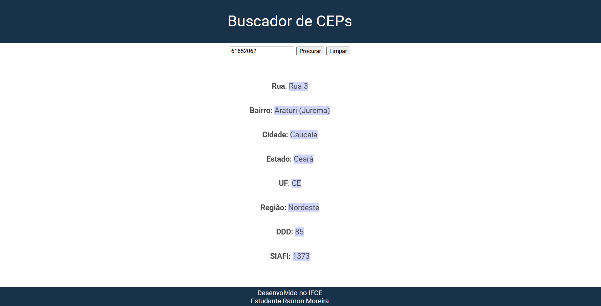

# Projeto buscador de Ceps

O objetivo do projeto é pesquisar CEPs em uma API chamada https://viacep.com.br.

## Design do projeto


## API utilizada
A API utilizada https://viacep.com.br retorna um JSON contendo as seguintes informações para o cep de exemplo 61652062.

```
https://viacep.com.br/ws/61652062/json/

{
  "cep": "61652-062",
  "logradouro": "Rua 3",
  "complemento": "(Lot Esplanada Araturi)",
  "unidade": "",
  "bairro": "Araturi (Jurema)",
  "localidade": "Caucaia",
  "uf": "CE",
  "estado": "Ceará",
  "regiao": "Nordeste",
  "ibge": "2303709",
  "gia": "",
  "ddd": "85",
  "siafi": "1373"
}
```

## Funcionalidades
- [x] Busca do CEP
- [x] Limpar dados
- [x] Design melhorado
- [x] Mais informações
- [ ] Responsividade
- [x] Rodapé

### Observações
> [!NOTE]
> Projeto feito na disciplina de programação web I do curso ADS do IFCE de Jaguaruana.

> [!IMPORTANT]
> Alguns CEPs podem não conter todas as informações. Por exemplo, em ceps que terminam com (-000)

## Contatos

E-mail: ramon.cont.tec.info@gmail.com
